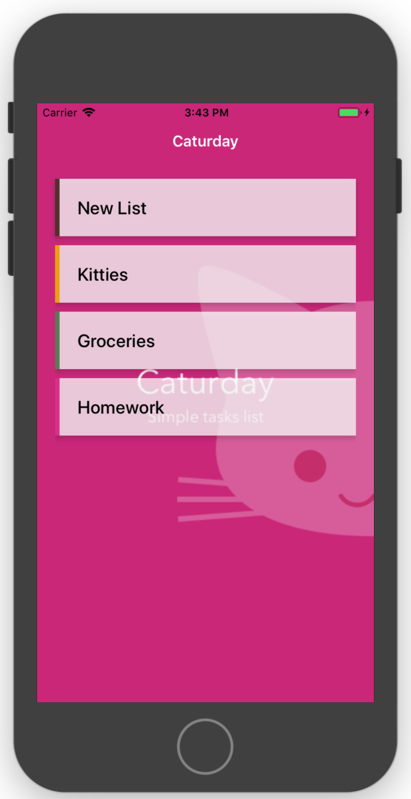

# caturday

Mobile task-tracking app built with React Native, Apollo-Client, & GraphQL-Yoga.



## Getting Started

Requires `Node >= v8` & `npm >= v5`.

```shell
npm run setup

## Run caturday/backend in separate Terminal window - TODO: need to make one command that does it all
cd backend/ && npm start

## Now in caturday/ Terminal
npm start
```

## GraphQL Playground

Go to http://localhost:4000/playground to open the in-browser GraphQL Playground. There, you can write your own queries & mutations.

Read [here](https://github.com/prisma/graphql-yoga#workflow) for more information. 

## Project Structure

- caturday
  - [assets/](assets/): Various assets, such as images, used in the app.
  - [backend/](backend/): GraphQL-Yoga backend. Should be run parallel with the frontend Expo app.
  - [components/](components/): Reusable-ish components.
  - [screens/](screens/): Each screen will have a home here. 
  - [App.js](App.js): Entry point for the app. Inlcudes the Apollo client setup & React Navigation routing.

